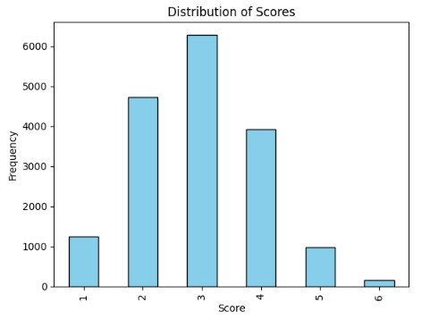

# Learning Agency Lab - Automated Essay Scoring 2.0

## 📄 Description

Essay writing is an important method to evaluate student learning and performance. It is also time-consuming for educators to grade by hand. Automated Writing Evaluation (AWE) systems can score essays to supplement an educator’s other efforts. AWEs also allow students to receive regular and timely feedback on their writing. However, due to their costs, many advancements in the field are not widely available to students and educators. Open-source solutions to assess student writing are needed to reach every community with these important educational tools.
Previous efforts to develop open-source AWEs have been limited by small datasets that were not nationally diverse or focused on common essay formats. The first Automated Essay Scoring competition scored student-written short-answer responses, however, this is a writing task not often used in the classroom. To improve upon earlier efforts, a more expansive dataset that includes high-quality, realistic classroom writing samples was required. Further, to broaden the impact, the dataset should include samples across economic and location populations to mitigate the potential of algorithmic bias.
In this competition, you will work with the largest open-access writing dataset aligned to current standards for student-appropriate assessments [Read more](https://www.kaggle.com/competitions/learning-agency-lab-automated-essay-scoring-2)

## 🧩 Approach

- Fine-tuned the DeBERTaV3 Extra Small English encoder-only transformer model using a multi-fold approach to learn the embedding matrix for essays. Preprocessed the essays and engineered various features based on sentences, paragraphs, and words.
- Additionally, applied K-means clustering to extract topic-based features from the essays. These prepared features, along with the embeddings, were used as inputs to train a LightGBM (LGBM) model for essay score prediction. 
- Achieved a Quadratic Weighted Kappa score of 0.80785 on the public dataset and 0.81809 on the private dataset.

### Score Distribution

    

