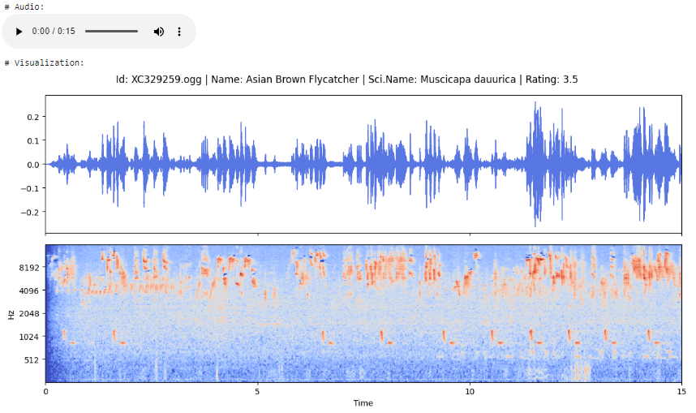
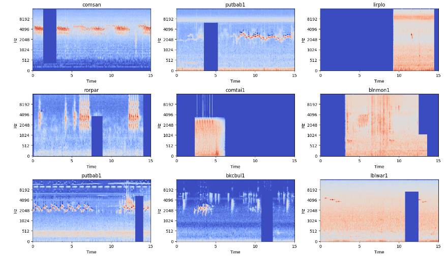

# BirdCLEF  2024

## 📄 Description
This Kaggle competition focuses on leveraging machine learning to monitor bird biodiversity in the Western Ghats, a critical biodiversity hotspot in India. Participants are tasked with developing computational solutions to analyze audio recordings and identify bird species by their calls, particularly under-studied, endemic, endangered, and nocturnal species. The challenge emphasizes training reliable classifiers with limited data, advancing conservation efforts led by V. V. Robin's Lab at IISER Tirupati.

By integrating passive acoustic monitoring (PAM) and machine learning, the competition seeks to address the challenges of traditional biodiversity surveys, offering scalable and cost-effective solutions for monitoring avian diversity. The project aims to enhance understanding of the effects of habitat and climate change on bird populations, ultimately contributing to the protection of the region's unique ecosystems and species. [Read more](https://www.kaggle.com/competitions/birdclef-2024)

## 🧩 Approach

Converted audio data into mel-spectrogram representations and applied data augmentation techniques, including normalization, RandomCutout, and MixUp. Utilized the EfficientNetV2-B2 architecture with modifications to the output layer to enable multi-label classification.

### Why Use Mel-Spectrograms?

Mel-spectrograms are used in this project due to their ability to provide a time-frequency representation of audio that is highly compatible with machine learning models. Specifically:

1. **Feature Richness**  
   Mel-spectrograms convert raw audio waveforms into a more compact and informative representation, highlighting the frequency components over time. This allows the model to capture detailed sound features efficiently.

2. **Human-Like Perception**  
   By utilizing the **mel scale**, mel-spectrograms emphasize frequencies that are perceptually important to humans, making them particularly effective for tasks like bird call recognition, where pitch and timbre are key.

3. **Model Compatibility**  
   Since mel-spectrograms can be treated as images, they are well-suited for deep learning models like Convolutional Neural Networks (CNNs), which are adept at extracting spatial patterns and hierarchies in data.

### Mel-spectrogram

    

### Data augmentation

    

