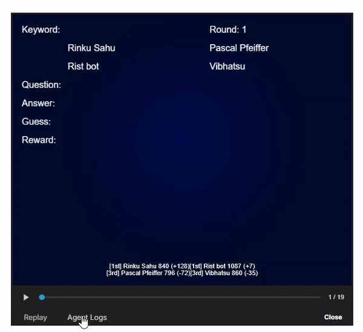

# LLM 20 Questions

## 📄 Description
The 20 Questions competition challenges teams to build two LLMs: one acts as the guesser, asking yes-or-no questions, and the other as the answerer, providing "yes" or "no" responses. The goal is to guess a secret word using the fewest questions, demonstrating skills in deductive reasoning, strategic questioning, and efficient information gathering. Success will highlight the ability of LLMs to ask insightful questions, perform logical inference, and work collaboratively within the constraints of limited guesses. [Read more](https://www.kaggle.com/competitions/llm-20-questions/overview)

## 🧩 Approach

- Guesser Agent: Performed one-shot prompt tuning for the guesser agent to enable efficient question narrowing from general to specific, using the history of previously asked questions within the game. This allowed the agent to make more informed guesses based on the questions asked.

- Answerer Agent: Implemented prompt tuning by providing detailed information about the secret word, helping the model better understand and respond to questions with accurate "yes" or "no" answers. This approach significantly improved the agent’s performance and had a positive impact on the leaderboard.

### Fine Tuning LLM

- Dataset Creation & Question Generation: Developed a dataset where an LLM generated a series of questions about a given word, starting from broader to more specific, spanning three levels of questioning. The answers were used as input, and the model iterated through the process to refine its understanding of the word.

- Model Fine-Tuning & Training: Implemented instruction fine-tuning using the **LoRA (Low-Rank Adaptation) technique on the Llama-3.1-8B-Instruct model. Applied Fully Sharded Data Parallel (FSDP) for efficient training but encountered out-of-memory (OOM) issues during the process.

## 🎲🤖 LLM 20 Questions Game 

