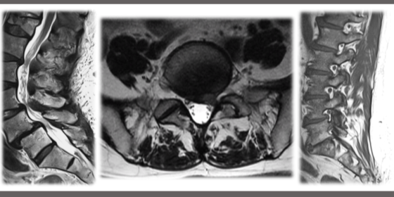
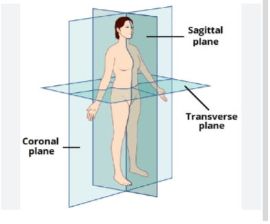

<!-- Centered Title -->
# RSNA 2024 Lumbar Spine Degenerative Classification

<!-- Centered Image -->

    

## 📄 Description
Low back pain is a leading cause of disability, affecting over 619 million people globally in 2020, often due to degenerative spine conditions like disc degeneration and spinal stenosis. MRI imaging of the lumbar spine helps radiologists evaluate these conditions for effective diagnosis and treatment.

In this RSNA-ASNR competition, we aim to explore the potential of AI in detecting and classifying five lumbar spine degenerative conditions—Left and Right Neural Foraminal Narrowing, Left and Right Subarticular Stenosis, and Spinal Canal Stenosis—across the intervertebral disc levels L1/L2 through L5/S1. Each condition is graded for severity, with classifications provided in the dataset as Normal/Mild, Moderate, or Severe. [Read more](https://www.kaggle.com/competitions/rsna-2024-lumbar-spine-degenerative-classification/overview)

## MRI Imaging orientation

    

## 🧩 Approach

### Step 1: Disc Level Identification and 3D ROI Extraction
   - Using sagittal T2-weighted MRI images, we identify and locate each of the five intervertebral disc levels within the lumbar spine. Based on the predicted locations of these levels, we select the corresponding axial T2-weighted MRI images.
   - For each disc level, we then crop a 3D region of interest (ROI) from the sagittal T2 and T1 images, focusing on the precise areas related to each disc level.

  <table>
    <tr>
      <td style="text-align:center;">
        
        
<strong>Locating Disc Levels</strong>

      </td>
      <td style="text-align:center;">
        
        
<strong>Sagittal T2</strong>

      </td>
    </tr>
    <tr>
      <td style="text-align:center;">
        
        
<strong>Sagittal T1</strong>

      </td>
      <td style="text-align:center;">
        
        
<strong>Axial T2</strong>

      </td>
    </tr>
  </table>

### Step 2: Image Stacking and Multi-Task Classification
   - For each of the five disc levels, we stack:
      - **Sagittal T2 and Axial T2 images**: creating a 3D stack with dimensions 3 x 7 x 7 per disc level.
      - **Sagittal T1 images**: creating a separate 3D stack with dimensions 9 x 7 x 7 per disc level.
   - These three distinct 3D stacks (for each disc level) are passed to separate 3D ResNet18 models. At the final layer, the outputs from the three models are concatenated, producing a unified output layer that predicts 25 classes, each with three sub-classes, representing the degenerative conditions at each disc level.

    
     
<strong>Network Architecture</strong>

## References 📚

1. DEEP SPINE (2018). [Research Paper](https://proceedings.mlr.press/v85/lu18a/lu18a.pdf).
2. Deep Learning Model for Automated Detection and Classification of Central Canal, Lateral Recess, and Neural Foraminal Stenosis at Lumbar Spine MRI (2021). [Research Paper](https://pubs.rsna.org/doi/epdf/10.1148/radiol.2021204289). 
3. What is Lumbar Foraminal Stenosis?. (2023).  [Video](https://www.youtube.com/watch?v=hKNQkwROtnc&t=1s). 

